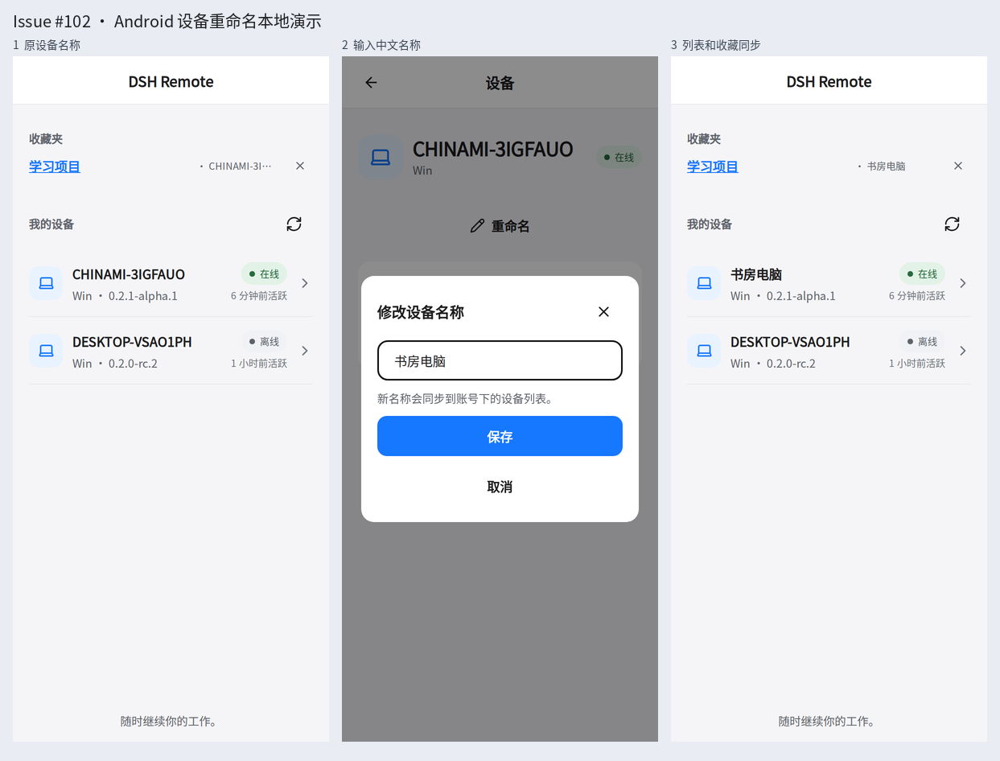

# Issue #102：Android 设备重命名本地演示

复用修改后的 `DevicesScreen`、`DeviceDetailScreen`、`DeviceRenameModal`、Zustand store、`RemoteServerApi`、`ServerSessionManager` 和快捷入口持久化逻辑。

**验证环境：React Native Web + 本地鉴权 fixture 服务端，393 × 852、2× 像素。** Expo 的原生存储、设备信息、触感和网络信息在演示中替换为浏览器适配器；未运行 Android APK、Android 模拟器或真实 hosted Server 账号。截图不表示原生或跨设备验收。

## 操作结果

- 在线 Host 从 `CHINAMI-3IGFAUO` 改为 `书房电脑`；请求使用带鉴权的 `PATCH /api/v1/account/devices/host-online`，首尾空白在提交前清除。
- 列表、已选设备、收藏和最近访问显示新名称；快捷入口名称已持久化。刷新、重新加载页面后仍使用服务端保存的名称。
- 离线 Host 从 `DESKTOP-VSAO1PH` 改为 `备用电脑`，不要求先连接 Host。键盘提交可保存。
- 空白名称不可保存；取消不发送请求；请求中禁用保存和关闭，单次提交只产生一个 PATCH。
- 注入服务端失败时保留原设备名称和编辑内容，显示错误，重试成功。
- 设备 ID、固定身份密钥、membership 和手机身份保持原值；切换账号后的旧请求响应不更新新账号界面。
- 英文文案及深色主题已检查；页面运行无浏览器异常。

## 构建与检查

- Android 类型检查通过；workspace 数据面校验及本地 renderer 生成通过。
- Android 全量测试：18 个文件、90 个测试通过。新增测试只覆盖鉴权、请求/响应和错误契约，没有新增纯 UI 测试。
- Android Hermes bundle 导出通过。保留既有 noble/hashes package-exports fallback 警告。
- `git diff --check` 通过。

## 截图

| 文件 | 场景 |
| --- | --- |
| [01-before.png](01-before.png) | 原设备列表 |
| [02-rename.png](02-rename.png) | 中文名称编辑弹窗 |
| [03-after.png](03-after.png) | 新设备名称及收藏同步 |
| [04-offline.png](04-offline.png) | 离线 Host 改名 |
| [05-failure.png](05-failure.png) | 失败后保留草稿并可重试 |
| [06-english-dark.png](06-english-dark.png) | 英文及深色主题 |
